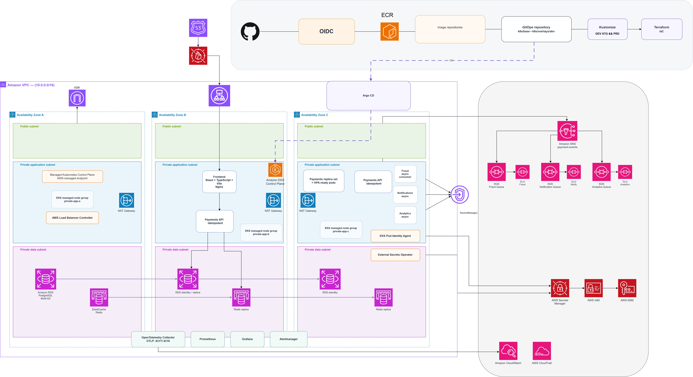

# NexPay Cloud-Native Payment Platform on AWS

NexPay is a fictional digital payments platform created as a cloud-native engineering laboratory.

The project simulates a payment platform that needs to handle normal traffic, traffic spikes, infrastructure failures and dependency degradation while remaining observable, secure and recoverable.

The goal is understand how a cloud platform is designed, automated, operated and evolved as a coherent system.

> NexPay is a laboratory project. Its performance, availability and recovery targets are engineering objectives for experimentation, not production guarantees.

## Architecture

The platform is built around Amazon EKS and separates application workloads from persistent data, messaging, observability and infrastructure.

Payments is the main synchronous workload, while components such as fraud evaluation, notifications and analytics can be processed asynchronously. Persistent data is handled separately from stateless application workloads through database, cache and messaging services.

The platform also includes Terraform for infrastructure, GitHub Actions for CI, ECR for container artifacts, Kustomize for Kubernetes configuration and Argo CD for GitOps-based delivery.

The architecture is designed to support multiple Availability Zones and multiple environments while keeping infrastructure and application configuration as separate concerns.



## Engineering Goals

The laboratory uses the following targets:

| Metric         | Target        |
| -------------- | ------------- |
| Normal traffic | 2,000 req/s   |
| Peak traffic   | 20,000 req/s  |
| Extreme test   | 50,000+ req/s |
| Availability   | 99.95%        |
| API latency    | p95 < 200 ms  |
| RPO            | ≤ 5 minutes   |
| RTO            | ≤ 30 minutes  |

These values are used to define experiments. The project distinguishes between the target condition and the result actually observed during testing.

## Platform

The platform is designed around reliability, scalability, observability, security and automation.

Infrastructure is defined with Terraform. Kubernetes workloads run on EKS, with application configuration managed through Kustomize and reconciled by Argo CD. GitHub Actions validates source code, builds container images and performs security checks before an artifact becomes a deployment candidate.

Observability is built around metrics, logs and traces using CloudWatch, Prometheus, Grafana and OpenTelemetry.

Security follows least privilege, workload identity, secrets management, encryption, auditability and container vulnerability scanning.

Application state is separated from stateless workloads, while asynchronous processing provides isolation, retries and backpressure for selected downstream operations.

## Repository

```text
NexPay/
├── application/
│   ├── frontend/
│   └── payments/
├── argocd/
│   ├── applications/
│   └── secrets/
├── k8s/
│   ├── base/
│   └── overlays/
│       └── dev/
├── terraform/
│   ├── environments/
│   │   └── dev/
│   └── modules/
├── docs/
└── .github/
    └── workflows/
```

The project is being built incrementally. Infrastructure, applications, delivery and operations are developed as separate layers and then integrated.

The main objective is to demonstrate that a modern cloud platform can be understood, operated, tested and evolved, not simply deployed.

## Disclaimer

NexPay is a fictional project created for learning and experimentation. The stated performance, availability and recovery values are laboratory targets and should not be interpreted as production guarantees.

Silas Santos LinkedIn: [https://www.linkedin.com/in/silas-santos-in-cloud/](https://www.linkedin.com/in/silas-santos-in-cloud/)
